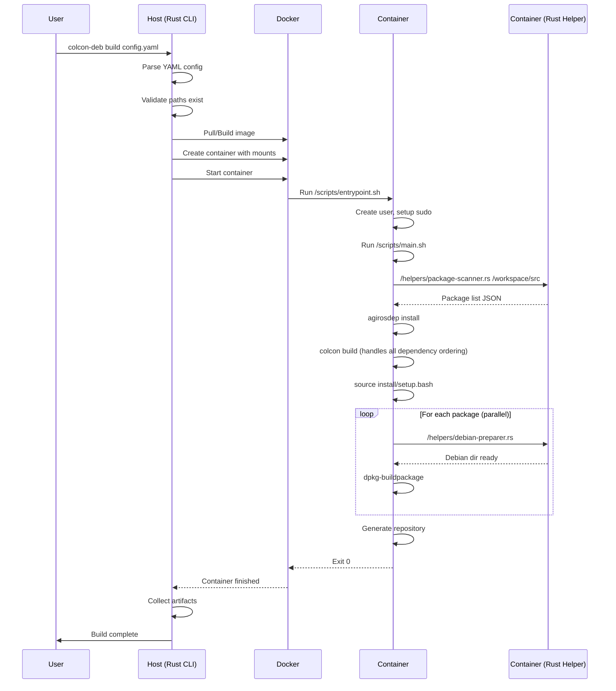

# Architecture Overview - Colcon Debian Packager (Rust)

This document describes the architecture of the Colcon Debian Packager rewritten in Rust. The system builds Debian packages for all packages in a ROS Colcon repository, executing the build process in a controlled container environment.

## Architecture Summary

The Colcon Debian Packager uses a **split architecture**:

1. **Host Application (Rust)**
   - Reads YAML configuration
   - Manages Docker containers
   - Monitors build progress
   - Collects generated artifacts
   - **Does NOT** install ROS or build packages directly

2. **Container Environment (Shell Scripts)**
   - Runs inside Docker with ROS pre-installed
   - Installs dependencies with agirosdep
   - Builds packages with colcon
   - Creates .deb files with dpkg-deb
   - Generates APT repository metadata

This design ensures the host system remains clean while providing isolated, reproducible builds.

### Security Model

The system follows security best practices:
- **Host**: Only requires Docker access, no ROS or build tools needed
- **Container**: Runs builds as non-root user with same UID/GID as host
- **Privileges**: Limited sudo access only for system package operations
- **File Permissions**: Output files have correct ownership matching host user

## System Overview

The Colcon Debian Packager follows a **two-stage architecture**:

### Stage 1: Host Orchestration
The host-side application (written in Rust) handles:
- Reading and validating configuration
- Setting up the build environment
- Managing Docker containers
- Monitoring build progress
- Collecting build artifacts

### Stage 2: Container Build Execution
Inside the container, build scripts handle:
- Installing ROS dependencies
- Building ROS packages with colcon
- Creating Debian packages
- Generating repository metadata

This separation ensures:
- **Isolation**: Builds don't affect the host system
- **Reproducibility**: Consistent build environment
- **Compatibility**: Can use different ROS distributions

## Core Architecture

### Host-Side Components

```
colcon-deb (host)
├── CLI Layer              # User interface
├── Configuration          # YAML parsing, validation
├── Docker Management      # Container lifecycle
├── Progress Monitoring    # Real-time status
└── Artifact Collection    # Output handling
```

### Container-Side Components

```
/workspace (container)
├── /scripts               # Build scripts from host
├── /source                # ROS source packages
├── /build                 # Build artifacts
├── /install               # Installed packages
└── /debian                # Generated .deb files
```

### Crate Structure

```
colcon-deb/
├── Cargo.toml              # Workspace root
├── crates/
│   ├── colcon-deb-cli/     # CLI application (host)
│   ├── colcon-deb-core/    # Core types and traits
│   ├── colcon-deb-config/  # Configuration management
│   ├── colcon-deb-docker/  # Docker integration (host)
│   ├── colcon-deb-ros/     # ROS package handling
│   ├── colcon-deb-debian/  # Debian packaging logic
│   └── colcon-deb-build/   # Build orchestration (host)
├── scripts/                # Container-side scripts
│   ├── entrypoint.sh      # Container entry (root)
│   ├── main.sh            # Main build script (user)
│   ├── create-repo.sh     # Repository creation
│   └── helpers/           # Cross-architecture rust-script helpers
│       ├── package-scanner.rs    # Rust script package discovery
│       ├── debian-preparer.rs    # Rust script debian management
│       ├── build-orchestrator.rs # Rust script build coordination
│       ├── progress-reporter.rs  # Rust script progress functions
│       └── check-requirements.rs # Rust script dependency verification
└── tools/                  # Supporting tools
```

### Component Architecture

```mermaid
graph TB
    subgraph "Host System"
        CLI[CLI Layer] --> BO[Build Orchestrator]
        BO --> CM[Config Manager]
        BO --> DS[Docker Service]
        BO --> PM[Progress Monitor]
        
        DS --> DC[Docker Client]
        DS --> VB[Volume Binding]
        
        PM --> UI[Progress UI]
        PM --> LS[Log Streamer]
    end
    
    subgraph "Docker Container"
        ES[Entry Script] --> RD[agirosdep install]
        RD --> CB[colcon build]
        CB --> DP[dpkg-deb]
        DP --> AR[apt-ftparchive]
    end
    
    DS -.->|launches| ES
    VB -.->|mounts| WS[/workspace]
    LS -.->|streams| CB
```

## Key Components

### 1. CLI Layer (`colcon-deb-cli`)
- **Purpose**: Command-line interface and user interaction
- **Responsibilities**:
  - Command parsing and validation
  - Configuration loading
  - Progress reporting
  - Error handling and user feedback

### 2. Core Module (`colcon-deb-core`)
- **Purpose**: Shared types, traits, and utilities
- **Key Types**:
  - `Package`: ROS package representation
  - `Dependency`: Dependency specification
  - `BuildResult`: Build outcome tracking
  - `Error`: Unified error types

### 3. Configuration (`colcon-deb-config`)
- **Purpose**: Configuration management and validation
- **Features**:
  - YAML configuration parsing
  - Environment variable substitution
  - Schema validation
  - Default value management

### 4. Docker Integration (`colcon-deb-docker`)
- **Purpose**: Container management and execution
- **Features**:
  - Async Docker API client
  - Image building and caching
  - Container lifecycle management
  - Volume and network configuration
  - Build output streaming

### 5. ROS Package Handling (`colcon-deb-ros`)
- **Purpose**: ROS-specific package operations
- **Features**:
  - Package.xml parsing for metadata
  - Extract dependencies for Debian control files
  - Build type detection (ament_cmake, ament_python, etc.)
  - Package discovery and enumeration

### 6. Debian Packaging (`colcon-deb-debian`)
- **Purpose**: Debian package generation
- **Features**:
  - Control file generation
  - Changelog management
  - Rules file creation
  - Package building with dpkg-deb

### 7. Build Orchestration (`colcon-deb-build`)
- **Purpose**: Coordinate the entire build process
- **Features**:
  - Parallel .deb package creation
  - Progress tracking and monitoring
  - Cache management
  - Error recovery

## Complete Workflow

### User Command to Completion



### Detailed Host-Side Flow

1. **Command Invocation**
   ```bash
   colcon-deb build --config my-workspace.yaml
   ```

2. **Configuration Loading**
   - Parse YAML file
   - Validate required fields: `colcon_repo`, `debian_dirs`, `docker.image/dockerfile`
   - Expand environment variables
   - Resolve relative paths

3. **Pre-flight Checks**
   - Verify Docker daemon is accessible
   - Check colcon_repo contains src/ directory
   - Create debian_dirs if it doesn't exist
   - Create output directory

4. **Container Image Preparation**
   - If `docker.image`: Pull image if not cached
   - If `docker.dockerfile`: Build image with tag
   - Ensure image has required tools (ROS, bloom, dpkg)

5. **Container Launch**
   - Prepare helper scripts for cross-architecture compatibility
   - Create container with volume mounts:
     ```yaml
     volumes:
       - ${colcon_repo}/src:/workspace/src:ro
       - ${debian_dirs}:/workspace/debian_dirs:rw
       - ${output_dir}:/workspace/output:rw
       - ${scripts_dir}:/scripts:ro
       - ${helper_scripts}:/helpers:ro
     ```
   - Set environment variables:
     - `HOST_UID`, `HOST_GID`
     - `ROS_DISTRO`
     - `PARALLEL_JOBS`

6. **Progress Monitoring**
   - Attach to container stdout/stderr
   - Parse structured output from helper tool
   - Update progress UI
   - Handle Ctrl-C gracefully

7. **Completion**
   - Wait for container exit
   - Check exit code
   - Verify output artifacts
   - Generate summary report

### Detailed Container-Side Flow

1. **Entry Point (as root)**
   ```bash
   #!/bin/bash
   # /scripts/entrypoint.sh
   
   # Create user matching host
   groupadd -g $HOST_GID builder
   useradd -u $HOST_UID -g $HOST_GID -m -s /bin/bash builder
   
   # Setup sudo permissions
   echo "builder ALL=(ALL) NOPASSWD: /usr/bin/apt*, /usr/bin/agirosdep, /usr/bin/dpkg*" > /etc/sudoers.d/builder
   
   # Fix permissions
   chown -R builder:builder /workspace
   
   # Drop to user
   exec su - builder -c "/scripts/main.sh"
   ```

2. **Main Build Script (as user)**
   ```bash
   #!/bin/bash
   # /scripts/main.sh
   
   source /opt/agiros/$ROS_DISTRO/setup.bash
   cd /workspace
   
   # Use Rust script helper to scan packages
   PACKAGES=$(/helpers/package-scanner.rs /workspace/src)
   
   # Install dependencies
   sudo agirosdep init || true
   agirosdep update
   sudo agirosdep install --from-paths src --ignore-src -y
   
   # Build all packages (colcon handles dependency ordering)
   colcon build --merge-install --parallel-workers $PARALLEL_JOBS
   
   # Source the built workspace
   source install/setup.bash
   
   # Create Debian packages (can be done in parallel)
   /helpers/build-orchestrator.rs
   ```

3. **Cross-Architecture rust-script Helpers (inside container)**
   
   We use `rust-script` for cross-architecture compatibility while maintaining Rust performance:
   
   - **package-scanner.rs**: Rust script for JSON package discovery
   - **debian-preparer.rs**: Rust script for bloom integration
   - **build-orchestrator.rs**: Rust script for build coordination
   - **progress-reporter.rs**: Rust script for structured output
   - **check-requirements.rs**: Rust script for dependency verification
   
   These scripts compile on-demand inside containers, working on any architecture (ARM64, AMD64) with near-native performance.

4. **Package Processing (Handled by build-orchestrator.rs)**
   ```rust
   // The build orchestrator handles the entire process:
   // 1. Scan packages with package-scanner.rs
   // 2. Prepare debian dirs with debian-preparer.rs  
   // 3. Build each package with dpkg-buildpackage
   // 4. Generate repository metadata
   
   // Progress reporting uses structured output via progress-reporter.rs:
   report_package_start(&package_name).await?;
   report_log("info", &format!("Building {}", package_name)).await?;
   report_package_complete(&package_name, success).await?;
   ```

5. **Repository Generation**
   ```bash
   cd /workspace/output
   dpkg-scanpackages . /dev/null | gzip -9c > Packages.gz
   apt-ftparchive release . > Release
   ```

## Host-Container Boundary

### Responsibilities Division

| Component           | Host Side              | Container Side                             |
|---------------------|------------------------|--------------------------------------------|
| **Configuration**   | Parse YAML, validate   | Use env vars                               |
| **User Management** | Pass UID/GID as env    | Create matching user                       |
| **Dependencies**    | Check Docker installed | Install ROS deps (sudo)                    |
| **Building**        | Monitor progress       | Execute colcon build (user) - handles deps |
| **Packaging**       | Define structure       | Create .deb files in parallel (user)       |
| **Repository**      | Collect artifacts      | Generate metadata (user)                   |
| **Logging**         | Stream to UI           | Write to stdout                            |
| **Privileges**      | Run Docker commands    | Use sudo for system ops                    |

### Communication Protocol

1. **Input**: Environment variables and volume mounts
2. **Output**: Exit codes and file artifacts
3. **Progress**: Stdout/stderr streaming
4. **Errors**: Non-zero exit codes with error logs

### Volume Mounts

```yaml
volumes:
  - ${colcon_repo}/src:/workspace/src:ro           # ROS packages (read-only)
  - ${debian_dirs}:/workspace/debian_dirs:rw       # Debian configs (read-write for bloom)
  - ./scripts:/scripts:ro                          # Build scripts (read-only)
  - ./output:/workspace/output:rw                  # Build artifacts (read-write)
  - ./cache:/workspace/.cache:rw                   # Build cache (read-write)
```

## Key Design Principles

### 1. Separation of Concerns
- Host handles orchestration and monitoring
- Container handles building and packaging
- Clear boundary with minimal coupling

### 2. Async-First Design (Host)
- Use Tokio for async runtime
- Non-blocking Docker operations
- Concurrent progress monitoring

### 3. Strong Type Safety
- Leverage Rust's type system
- Use newtypes for domain concepts
- Compile-time validation

### 4. Error Handling
- Result-based error propagation
- Detailed error context
- User-friendly error messages

### 5. Performance
- Parallel container execution
- Efficient caching strategies
- Minimal data copying

## External Dependencies

### Critical Dependencies
- `tokio`: Async runtime
- `bollard`: Docker API client
- `serde`/`serde_yaml`: Configuration parsing
- `clap`: CLI framework
- `tracing`: Structured logging

### ROS 2 Integration
- Parse ROS 2 package.xml format (v3)
- Support ROS 2 distributions (loong, Iron, pixiu, etc.)
- Handle ament_cmake and ament_python build systems
- No ROS 1 or catkin support

## Security Considerations

- Container isolation for builds
- No privileged container operations
- GPG signing support for packages
- Secure handling of credentials

## Extensibility Points

1. **Custom Build Steps**: Plugin system for additional build phases
2. **Package Formats**: Support for other package formats beyond .deb
3. **Cloud Storage**: Integration with artifact repositories
4. **CI/CD Integration**: GitHub Actions, GitLab CI support

## Performance Characteristics

- **Parallel Builds**: Up to N concurrent package builds
- **Docker Layer Caching**: Reuse base images and dependencies
- **Incremental Builds**: Skip unchanged packages
- **Memory Usage**: Streaming processing for large workspaces

## Monitoring and Observability

- Structured logging with `tracing`
- Build metrics and timings
- Progress reporting
- Error aggregation and reporting
